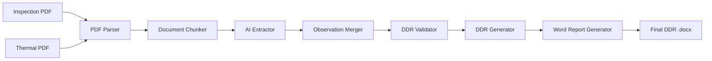
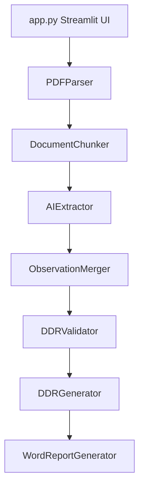
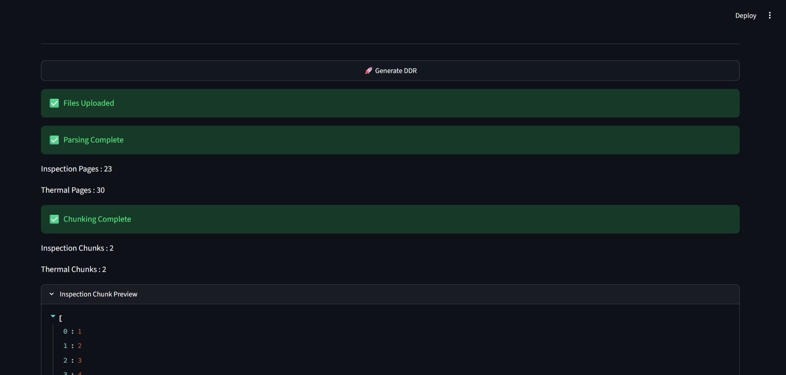
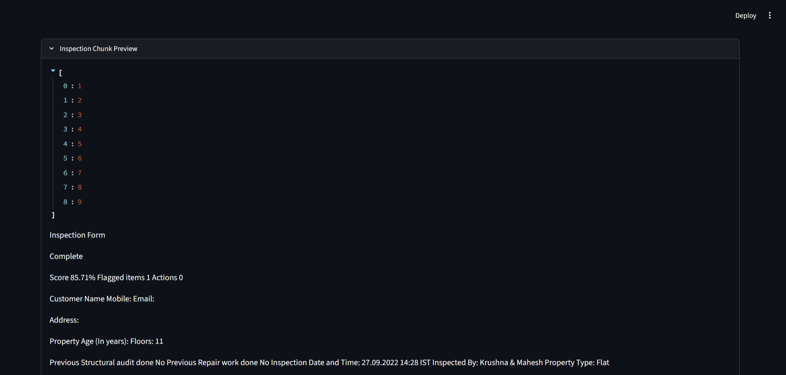
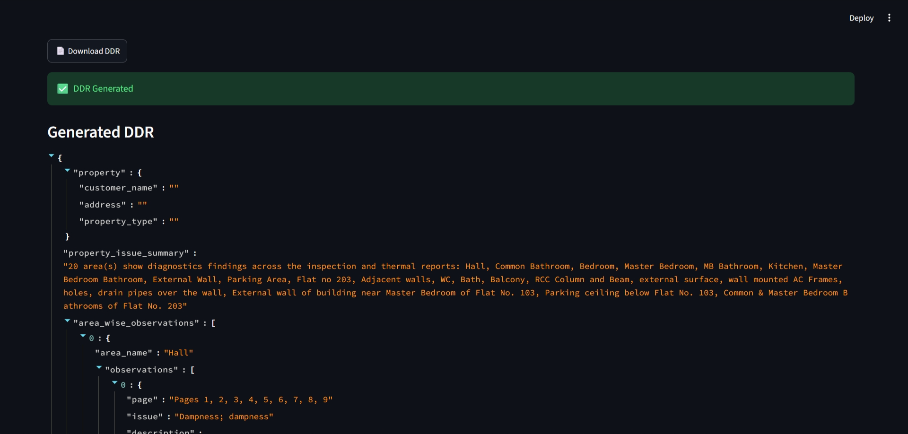

# UrbanRoof DDR Generator

UrbanRoof DDR Generator is a Streamlit application that reads an Inspection Report and a Thermal Report, extracts observations, merges related findings by area, validates the data, and generates a client-friendly Detailed Diagnostic Report (DDR) in Word format.

The pipeline is designed to work on the sample files in this repository and on similar inspection/thermal report sets with the same structure.

## What It Does

- Extracts structured observations from inspection and thermal PDFs.
- Combines related findings by area so inspection and thermal evidence appear together.
- Removes duplicate points and highlights conflicts.
- Handles missing values with explicit `Not Available` fallbacks.
- Carries page numbers and extracted image paths into the final report.
- Generates a polished DDR with seven required sections.

## Sample Inputs

- [Sample Inspection PDF](uploads/Sample%20Report.pdf)
- [Sample Thermal PDF](uploads/Thermal%20Images.pdf)

## Output

The app generates a Word document at `outputs/final_ddr.docx`.

## Tech Stack

- Python
- Streamlit
- PyMuPDF
- python-docx
- Gemini API

## Pipeline Overview



## Architecture



## DDR Structure

The generated DDR contains these mandatory sections:

1. Property Issue Summary
2. Area-wise Observations
3. Probable Root Cause
4. Severity Assessment
5. Recommended Actions
6. Additional Notes
7. Missing / Unclear Information

## Core Modules

| Module | Responsibility |
| --- | --- |
| `src/parser.py` | Extracts text, page numbers, and embedded images from PDFs. |
| `src/chunker.py` | Splits parsed pages into manageable chunks for AI extraction. |
| `src/extractor.py` | Calls Gemini to extract structured inspection and thermal JSON. |
| `src/merger.py` | Merges inspection and thermal observations by area and carries images. |
| `src/validator.py` | Removes duplicates, detects conflicts, infers severity/root cause, and builds report-ready data. |
| `src/ddr_generator.py` | Converts validated data into the final DDR structure. |
| `src/word_report.py` | Writes the Word report with tables, headings, and images. |

## How It Works

1. Upload the inspection PDF and thermal PDF.
2. The parser extracts text, pages, and images from each document.
3. The chunker prepares document chunks for AI extraction.
4. Gemini extracts structured observations.
5. The merger combines related findings by area.
6. The validator removes duplicates, checks for missing information, and flags conflicts.
7. The DDR generator builds the final seven-section report structure.
8. The Word report writer creates the final `.docx` file with embedded images.

## Screenshots

### App Flow



### Merge View



### Final DDR Output



## Key Behaviors

- Missing thermal observation is written as `Thermal Observation Not Available`.
- Missing images are written as `Image Not Available`.
- Duplicate observations are removed.
- Conflicting inspection and thermal evidence is reported explicitly.
- Thermal findings are matched to the closest inspection area when possible.
- Unmatched thermal findings are placed in a separate section instead of being forced into `Unknown`.

## Run Locally

### 1. Create and activate the virtual environment

```bash
python -m venv .venv
.venv\Scripts\activate
```

### 2. Install dependencies

```bash
pip install -r requirements.txt
```

### 3. Add your Gemini key

Create a `.env` file with:

```env
GEMINI_API_KEY=your_key_here
```

### 4. Run the app

```bash
streamlit run app.py
```

## Project Layout

```text
urbanroof-ddr/
├─ app.py
├─ uploads/
│  ├─ Sample Report.pdf
│  └─ Thermal Images.pdf
├─ outputs/
├─ extracted_images/
├─ img/
├─ src/
│  ├─ parser.py
│  ├─ chunker.py
│  ├─ extractor.py
│  ├─ merger.py
│  ├─ validator.py
│  ├─ ddr_generator.py
│  └─ word_report.py
└─ test_*.py
```

## Notes

- The final report is intended to stay client-friendly and readable.
- The solution is generalized to similar inspection and thermal reports, not just the sample PDFs.
- For submission, keep the sample PDFs, screenshot images, and generated Word output in the repository so reviewers can verify the full flow quickly.
